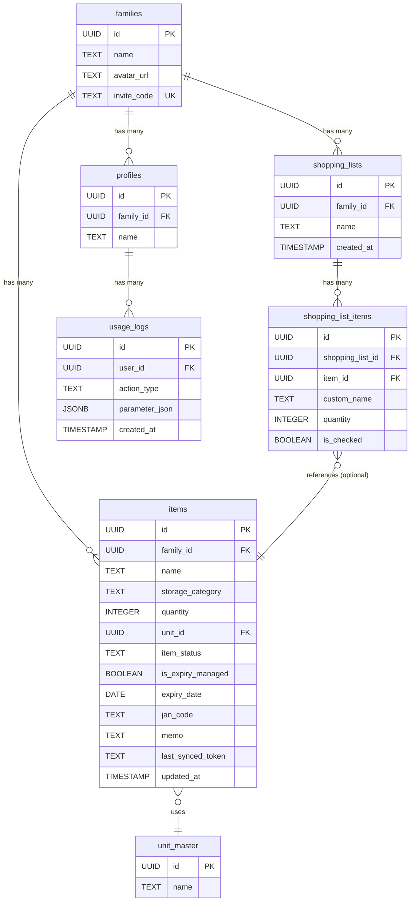

---
tags:
created: 2025-08-05 10:42
updated: 2025-08-05 10:48
---

```mermaid
erDiagram
  families {
    UUID id PK
    TEXT name
    TEXT avatar_url
    TEXT invite_code UK
  }

  profiles {
    UUID id PK
    UUID family_id FK
    TEXT name
  }

  items {
    UUID id PK
    UUID family_id FK
    TEXT name
    TEXT storage_category
    INTEGER quantity
    UUID unit_id FK
    TEXT item_status
    BOOLEAN is_expiry_managed
    DATE expiry_date
    TEXT jan_code
    TEXT memo
    TEXT last_synced_token
    TIMESTAMP updated_at
  }

  unit_master {
    UUID id PK
    TEXT name
  }

  shopping_lists {
    UUID id PK
    UUID family_id FK
    TEXT name
    TIMESTAMP created_at
  }

  shopping_list_items {
    UUID id PK
    UUID shopping_list_id FK
    UUID item_id FK
    TEXT custom_name
    INTEGER quantity
    BOOLEAN is_checked
  }

  usage_logs {
    UUID id PK
    UUID user_id FK
    TEXT action_type
    JSONB parameter_json
    TIMESTAMP created_at
  }

  families ||--o{ profiles : "has many"
  families ||--o{ items : "has many"
  families ||--o{ shopping_lists : "has many"
  profiles ||--o{ usage_logs : "has many"
  items }o--|| unit_master : "uses"
  shopping_lists ||--o{ shopping_list_items : "has many"
  shopping_list_items }o--|| items : "references (optional)"

```
