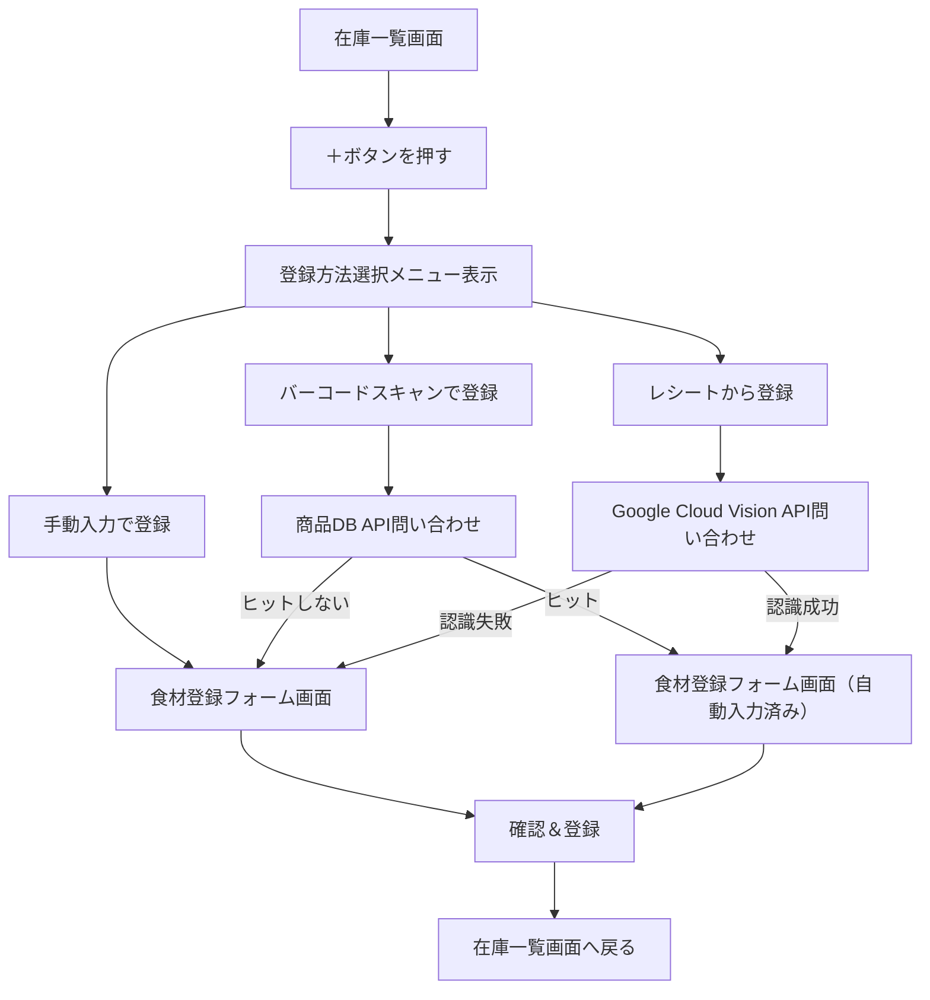

---
tags:
created: 2025-08-04 19:37
updated: 2025-08-04 19:37
---

```mermaid
flowchart TD
  Start[在庫一覧画面] --> PlusButton[＋ボタンを押す]
  PlusButton --> Menu[登録方法選択メニュー表示]

  Menu --> ManualInput[手動入力で登録]
  Menu --> BarcodeScan[バーコードスキャンで登録]
  Menu --> ReceiptOCR[レシートから登録]

  ManualInput --> InputForm[食材登録フォーム画面]
  BarcodeScan --> BarcodeAPI[商品DB API問い合わせ]
  BarcodeAPI -->|ヒット| PrefilledForm[食材登録フォーム画面（自動入力済み）]
  BarcodeAPI -->|ヒットしない| InputForm
  ReceiptOCR --> OCRAPI[Google Cloud Vision API問い合わせ]
  OCRAPI -->|認識成功| PrefilledForm
  OCRAPI -->|認識失敗| InputForm

  InputForm --> Confirm[確認＆登録]
  PrefilledForm --> Confirm

  Confirm --> BackToList[在庫一覧画面へ戻る]

```
