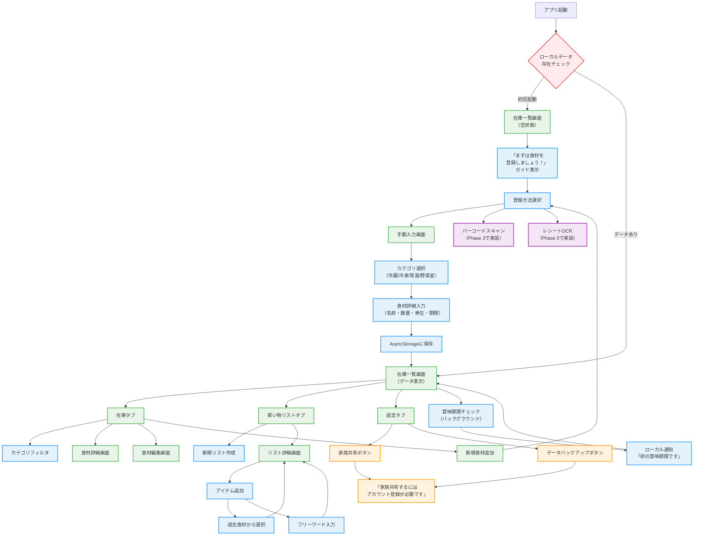
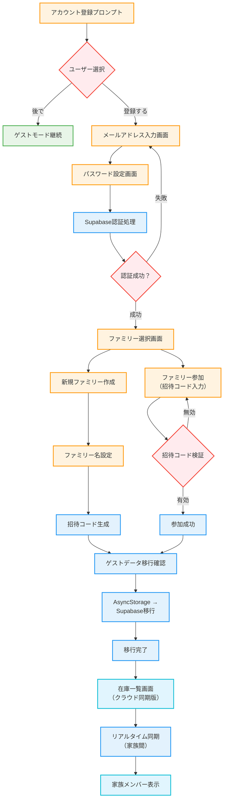
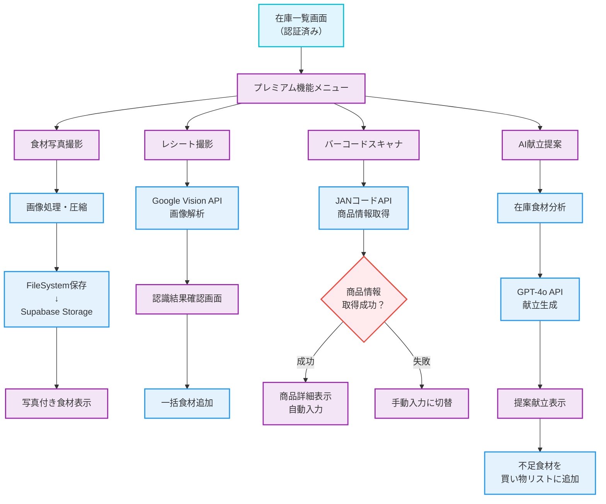

---
tags:
created: 2025-08-06 23:54
updated: 2025-10-15 23:10
---

# PocketPantry 画面遷移図 v2.0

_ゲストファーストアプローチによる画面フロー_

**更新日**: 2025年8月6日  
**版数**: v2.0（重要な設計変更を含む）

---

## 🎯 Phase 1: ゲストモード画面フロー



---

## 🔄 Phase 2: 認証・家族共有フロー



---

## 🚀 Phase 3: 高度機能フロー



---

## 🎨 カラールール（更新版）

### Phase別の色分け

- **🟢 ゲストモード (緑系)**: 即座に利用可能な基本機能
- **🟠 認証機能 (オレンジ系)**: アカウント登録・ファミリー機能
- **🔵 クラウド機能 (水色系)**: 認証後の高度な同期機能
- **🟣 プレミアム機能 (紫系)**: 将来の有料機能
- **⚪ アクション (青系)**: ユーザーアクション・処理
- **🔴 判定 (赤系)**: 条件分岐・判定処理

---

## 🔄 主要な変更点（v1.0 → v2.0）

### ❌ 削除された画面・フロー

- **初回ログイン強制画面**
- **強制的なファミリー作成プロセス**
- **サインアップ必須フロー**

### ✅ 新規追加された画面・フロー

- **ゲストモード在庫管理**
- **段階的認証プロンプト**
- **データ移行確認画面**
- **ローカル通知システム**

### 🔄 変更された画面・フロー

- **アプリ起動** → 即座に在庫一覧画面表示
- **認証タイミング** → 家族共有・バックアップ時のみ
- **データ保存** → ローカルファースト戦略

---

## 📱 ユーザージャーニー例

### 👤 初回ユーザー（田中さん）

```
アプリダウンロード
↓
在庫一覧画面（空）+ ガイド表示
↓
「卵」を手動入力
↓
3日後：賞味期限通知
↓
2週間後：家族共有したくなる
↓
アカウント登録プロンプト
↓
ファミリー作成・招待コード生成
```

### 👨‍👩‍👧‍👦 家族ユーザー（佐藤さん）

```
招待コード受信
↓
アプリダウンロード
↓
招待コード入力
↓
ファミリー参加成功
↓
リアルタイム同期で家族の在庫を確認
↓
買い物リスト更新
```

---

## 🎯 UX設計の意図

### 摩擦の最小化

- **0クリックで価値提供** - ダウンロード後即座に機能利用
- **段階的な情報提供** - 必要な時のみ詳細説明
- **価値実感後の登録促進** - 使ってみて便利だと感じてから

### エンゲージメント向上

- **即座のフィードバック** - 入力後すぐに結果表示
- **プログレッシブディスクロージャー** - 段階的な機能開示
- **コンテキストアウェアネス** - 適切なタイミングでの機能提案

---

**更新履歴**

- v1.0 (2025-08-05): 初版作成（認証優先フロー）
- v2.0 (2025-08-06): ゲストファーストアプローチへの全面改訂
